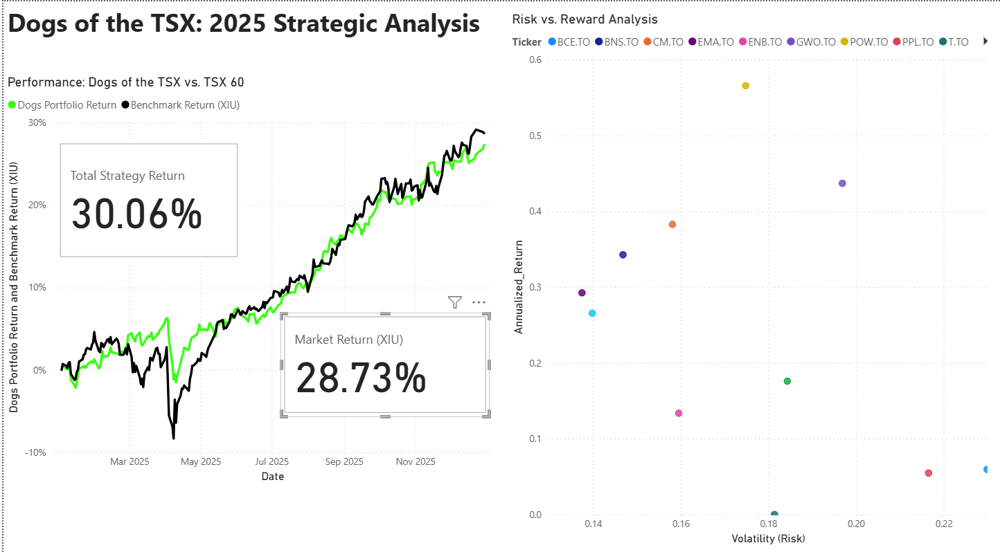

# Dogs of the TSX: 2025 Strategic Analysis

### **Project Overview**
I built a dynamic Power BI dashboard to backtest the "Dogs of the TSX" investment strategy against the Canadian market benchmark (XIU) for the 2025 period. The goal was to determine if a high-yield systematic approach could generate alpha while managing volatility.

### **The Results (Live Dashboard)**

### **Key Findings**
* **Strategy Return:** 30.06% 🟢
* **Benchmark (XIU) Return:** 28.73% ⚫
* **Alpha Generated:** +1.33% 

### **How I Built This**
* **Data Source:** Yahoo Finance (Daily Price Data for TSX 60 tickers).
* **Engine:** Power BI & DAX.
* **Key Mechanics:**
    * **Dynamic Calculations:** Used DAX measures to calculate `Cumulative Return` dynamically using `(End Price - Start Price) / Start Price`.
    * **Risk Analysis:** Built a "Volatility vs. Reward" scatter plot to visualize the risk profile of each holding, proving the strategy's returns were efficient, not just lucky.

### **Project Files**
* **`Dogs_Strategy_Analysis.pbix`**: The full Power BI source file. Feel free to download it to see the DAX formulas and data model structure!
